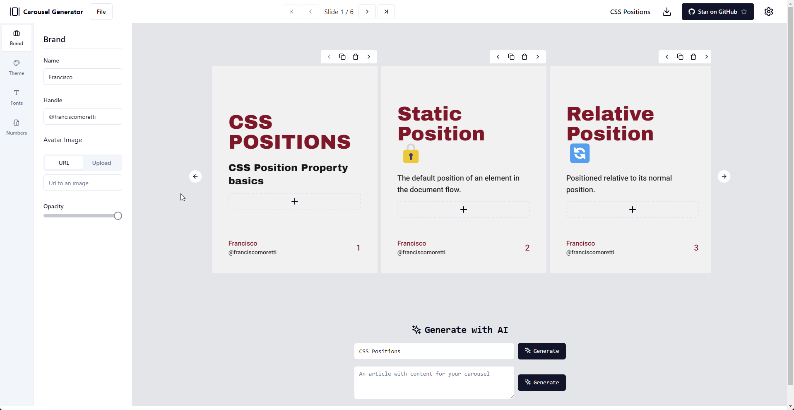

# Carousel Generator



**Carousel Generator** is an open-source carousel generator tool that allows you to easily create and customize carousels for your LinkedIn.

🔗 Access the Carousel Generator at [carouselgenerator.vercel.app](https://carouselgenerator.vercel.app)

## Features

Carousel Generator comes packed with a variety of features to help you create stunning carousels effortlessly:

- ✍️ Forms powered by [react-hook-form](https://react-hook-form.com/)
- 🎨 Sleek UI components from [Shadcn/ui](https://ui.shadcn.com/)
- ✅ Input validation using [ZOD](https://zod.dev/)
- 🌐 Responsive layout for various screen sizes
- 🔄 Automatic updates on changes
- 🍥 Icons from [Lucide Dev](https://lucide.dev/)
- 🆎 Titles auto-balance (no orphan words)
- 💾 Data persists with browser refresh
- ⚙️ Configure the carousel with various settings
- ➕ Add, remove, or reorder slides with ease
- 🖼️ Different types of slides, including Intro, Content, and Outro
- 📤 Export and Import settings
- 📥 Export and import slide content
- 😃 Support for emojis to spark joy with your carousels
- 📝 Select fonts for titles and content to match your style

## Usage

1. Visit [carouselgenerator.vercel.app](https://carouselgenerator.vercel.app) to access the Carousel Generator tool.

2. Customize your carousel settings and add/edit slides as needed.

3. Download your carousel to post on social media

## Installation

To get started with Carousel Generator, follow these simple installation steps:

1. Install the required dependencies using `pnpm`:

   ```bash
   pnpm i
   ```

   or

   ```bash
   npm install
   ```

2. Start the development server:

   ```bash
   pnpm dev
   ```

   or

   ```bash
   npm run dev
   ```

Now you're all set to start using Carousel Generator!

## License

This project is licensed under the [MIT License](LICENSE).

---

Happy carousel generating! If you have any questions or need assistance, feel free to [open an issue](https://github.com/FranciscoMoretti/carousel-generator/issues) on GitHub.

🚀 Thank you for using Carousel Generator!
