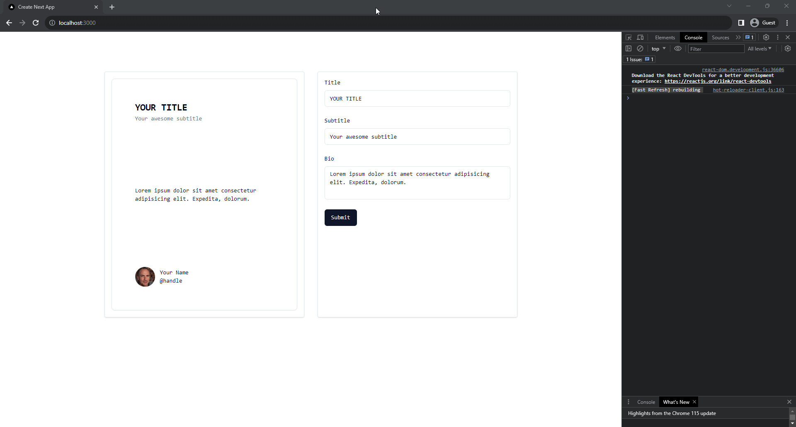

A starter repository for a simple 2 panels application with Next.js, TypeScript, Shadcn/UI, Zod, React-Form and TailwindCSS

## Features

- Forms with react-form
- Shadcn/ui for UI
- ZOD for input validation
- Responsive 2 panels layout
- Updated automatically on changes
- Data persists with browser refresh
